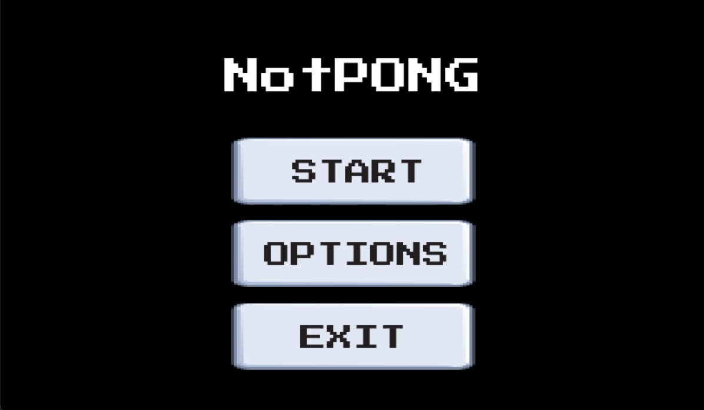

# NotPONG 🎮

Welcome to **NotPONG**, my adaptation of the classic Pong game from way back in 1972, made entirely with Python and Pygame!


## 🚀 Getting Started

Want to start playing NotPONG right away? Just follow these simple steps:

1. **Clone the Repository**
   ```bash
   git clone https://github.com/Harsh-44/NotPONG.git


2. **Navigate to the Project Directory**
   ```bash
   cd NotPONG

3. **Install the Requirements**
   ```bash
   pip install -r requirements.txt

4. **Run the Game**
   ```bash
   python notpong.py

**Have Fun! 🎉**

## 🎮 Game Modes
NotPONG offers two game modes:

**Single Player**: Test your skills against the AI. Can you beat the computer?

**Two Player**: Challenge your friends in a head-to-head battle of Pong supremacy!

## 🕹️ Controls
Player 1 (Right Paddle): Use the UP and DOWN arrow keys to move.

Player 2 (Left Paddle): Use the W (up) and S (down) keys.

Pause/Return to Menu: Press P at any time.

Exit the Game: Click on the Exit text at the top-right corner.
## 🌟 Features
**Retro Aesthetic**: Relive the golden age of arcade games with NotPONG's classic look and feel.

**Responsive Controls**: Smooth and responsive controls for a great gaming experience.

**Customizable Difficulty**: Choose between Easy, Medium, or Hard to match your skill level.

**Sound Effects**: Retro sound effects to immerse you in the game. (WIP)

**Score Tracking**: Keep track of your wins and challenge yourself to improve! (WIP)
## 📸 Screenshots

### Main Menu


The main menu where you can start the game, access options, or exit. The button labeled "Start" initiates the game, while "Options" lets you set the difficulty and "Exit" closes the game.


### Set Difficulty


Choose your preferred difficulty level from easy, medium, or hard. This screen allows you to adjust the opponent's speed to match your skill level, providing a tailored challenge.

### Select Game Mode


Select your game mode after starting the game. Choose between playing against the computer or engaging in a two-player mode where you and a friend can battle it out.

### Running Match


In-game screenshot showing an active match. The player and opponent paddles are visible along with the ball in motion. The score display and the gameplay are showcased here.

## 🛠️ Built With
**Python**: The backbone of NotPONG.

**Pygame**: A cross-platform set of Python modules designed for writing video games.
## 🤝 Contributing
I would love contributions! Whether you're fixing bugs, adding new features, or improving documentation, they are welcome. To contribute:

Fork the repository.

Create a new branch.

Make your changes.

Submit a pull request.

## 📜 License
This project is licensed under the MIT License - see the LICENSE file for details.

## Acknowledgments
Classic Pong Game for the inspiration.

Pygame community.

**Made with ❤️ by Harsh Hareendran Kallinkeel**
